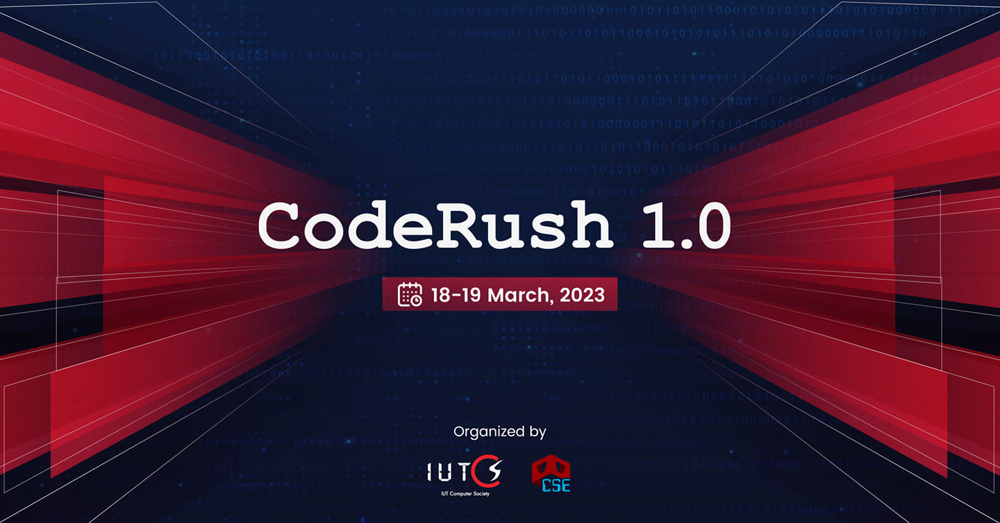

<head>
  
</head>

# **Coderush 1.0**
*This repo contains the challenges for Intra IUT Coderush 1.0 CTF competition organized by IUT CTF club and IUTCS.*  

### **Categories:** 
- **Ancient Ciphers**
  - KingCeaser
  - MorseSymbol
  - Symbol1
  - Symbol2 
  - Symbol3 
  - Vinegar
- **Forensics**
  - brokenNote
  - CrackMeUp
  - HackedNetwork
  - ListenToTheCat
  - MatryoshkaDoll
  - NumbersHaveMeaning
  - Pendrive
  - reconstruction
- **Misc**
  - explode
  - explore
  - GuesstheFavouriteNumber
  - nth
  - regex_showdown
  - ripg
- **Modern Crypto**
  - 6 Encoding 4
  - Complex XOR
  - Noisy Encryption
  - Prime in Haystack
  - RSA
  - Simple XOR
- **OSINT**
  - ExperimentalUse
  - FlyHigh
  - LookIntoTheMetaverse
- **Pwn**
  - format_string_ftw
  - seed
  - three_sum
- **Reverse**
  - cake
  - keasy
  - matrix
  - nest
- **Web**
  - >(WIP)
