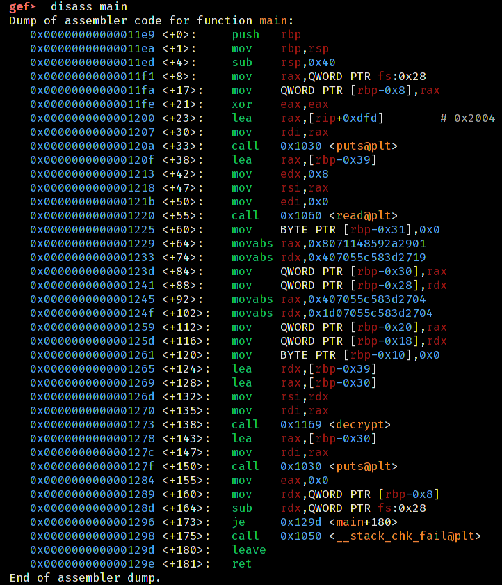

# Keasy

## Solution

First let's look at what gdb shows us when we run the program inside gdb.


We can see that there is a `decrypt` function and `main` function that might be our topic of interest.

let's look at the main function.



We can see that the main function prints a string, takes an input. We aslo see some constants in the disassembly. Later we can see that the `decrypt` function is being called with two parameters in `rdi` and `rsi` respectively. We know this because of x86_64 calling [convention](https://aaronbloomfield.github.io/pdr/book/x86-64bit-ccc-chapter.pdf).


As we recall the program prompts for a key. This key is likely the one that will decrypt our encrypted key that is stored inside the program as constants. Later the program prints out the constants using puts. So, we can assume that a pointer to the encrypted flag and key is passed to the decrypt function and the decrypt function decrypts the encrypted flag inplace.

Now, let's look at what decrypt function does


The function calculates length of the two strings (encrypted flag and key).

It forms a loop starting with <decrypt+55> and ending at <decrypt+122>. It might seem a little difficult to figure out what the loop actualy does by just looking at the assembly but it is not that hard. If we are learning assembly, this code can come very handy in understanding assembly in depth.

For now, let's use ghidra to look at the function with power of CIA.


We can see that the encryption or decryption in place is simple xor cicle. Now the tricky part is there is no clue given as to what we need to xor with to get the original flag or the key. As if one can be obtained, the other unknown can be obtained by simply xoring them.
```c
x ^ y = z
z ^ x = y
y ^ z = x
```
But we have another clue in the shadows though. The flag format is `coderush{flag}` we can see that the first 8 characters of the flag will be `coderush`. And also the key is also 8 chars long. So, the first 8 bytes of the encrypted flag i.e, `0x8071148592a2901` can be xored with 'coderush' to get the key and we can then pass the key to the program who will give us the full flag.

The following c [program](sol.c) will find out the key:

```c
#include <stdio.h>

void solve(char* a, char* b, int len) {
    for (int i = 0; i < len; i++) {
        printf("%c",a[i]^b[i]);
    }
}

int main() {
    long bytes = 0x8071148592a2901;
    char known[] = "coderush";
    solve(&bytes,known,8);
}

```
After compiling the program, we run the program and pipe the output to keasy.
```bash
./sol | ./keasy
```
## Flag
`coderush{flag}`

***Note: that the flag in the writeup is not the original flag. The binary it was written on is also not of the original binary. The purpose of this solution is to walk you through to find the flag on your own.***